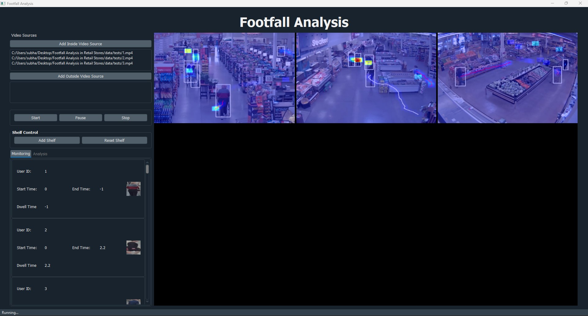
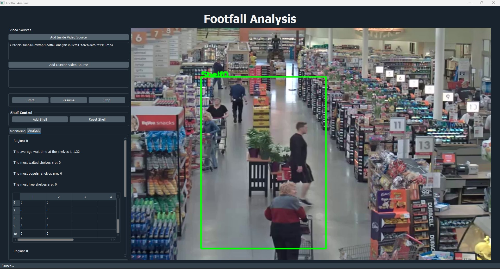

# Footfall-Analysis-in-Retail-Stores

### Real-time footfall analysis in retail stores

- Footfall analysis in real-time (supporting multiple video streams e.g., IP cameras, webcam) with a desktop app.
- Calculate demographics such as dwell times/heat maps at a particular location e.g., near shelfs.
- Customize the layout e.g., shelf control.
- People detection (using YOLO) along with age/gender detection if applicable.
- Track the path of customers in the stores.
- Analysis data is also stored in the logs.

**Example test run showcasing multiple video streams with customer detection/tracking, dwell times/heat maps:**

<div align="center">
    
</div>

**Example test run showcasing shelf control:**

<div align="center">
    
</div>

> NOTE: This project is experimental and not maintained actively. If any bugs/problems are encountered, please open an issue.

--- 

## Table of Contents

**TBD!**

* [Simple theory](#simple-theory)
* [Running the app](#running-the-app)
    - [Install the dependencies](#install-the-dependencies)
    - [Run the desktop app](#run-the-desktop-app)
* [Features](#features)
* [References](#references)

---

## Running the app

### Install the dependencies

First up, install all the required Python dependencies by running: ```
pip install -r requirements.txt ```

> NOTE: Development environment is Windows/Python version 3.7.4 (there can always be version conflicts between the dependencies, OS, hardware etc.).

### Run the desktop app

The desktop application is powered by PyQt, run it with: ```python footfall.py```.

---

*saimj7/ 14-06-2020 - © <a href="http://saimj7.github.io" target="_blank">Sai_Mj</a>.*
